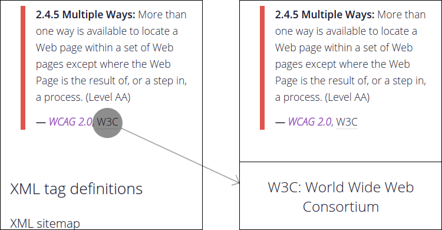

# abbr-touch [](https://www.npmjs.org/package/abbr-touch)

[](https://travis-ci.org/Tyriar/abbr-touch)
[](https://codeclimate.com/github/Tyriar/abbr-touch)

Makes <abbr> element title attributes touch accessible.

[][1]


## Installing

```bash
# via bower
bower install --save abbr-touch

# via NPM
npm install --save abbr-touch
```


## Including

```html
<!-- Bower -->
<script src="bower_components/abbr-touch/abbr-touch.js"></script>

<!-- NPM -->
<script src="node_modules/abbr-touch/abbr-touch.js"></script>
```


## Usage

```javascript
// default handler on document (alert)
abbrTouch();

// default handler, apply to descendants of #some-element
abbrTouch(document.querySelector('#some-element'));

// custom handler, apply to descendants of #some-element
abbrTouch(document.querySelector('#some-element'), myHandler);

function myHandler(target, title, touchX, touchY) {
  console.log(target);
  console.log(title);
  console.log(touchX);
  console.log(touchY);
}
```

A deeper example of usage can be found in [demo.html][2]. A live demo can be viewed on [Growing with the Web][4].


## See also

- [touchtap-event][3]
- [abbr-fill.js][1]


  [1]: https://github.com/Tyriar/abbr-fill.js
  [2]: https://github.com/Tyriar/abbr-touch.js/blob/master/demo.html
  [3]: https://github.com/Tyriar/touchtap-event
  [4]: http://www.growingwiththeweb.com/projects/abbr-touch/
